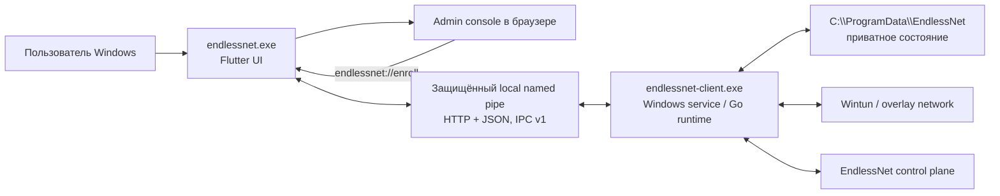
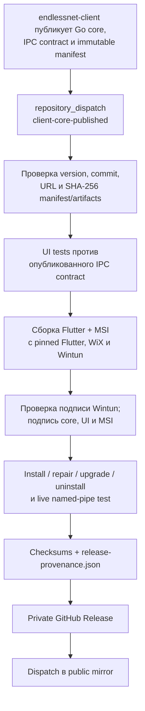

# EndlessNet Client for Windows: архитектура, решения и развитие

- Статус: действующая архитектура и ориентиры развития
- Владелец: `unng-lab/endlessnet-client-ui`
- Последняя сверка с реализацией: 2026-07-21

## 1. Назначение документа

Этот документ описывает Windows-клиент EndlessNet как целостный продукт:

- desktop-приложение на Flutter;
- установленный Windows service с Go runtime;
- локальный IPC-контракт между UI и service;
- MSI-упаковку, подписание, WinGet-манифесты и выпуск релизов;
- принятые архитектурные решения и их последствия;
- возможные направления дальнейшего развития.

Документ отвечает на вопросы «за что отвечает этот репозиторий», «почему
система устроена именно так» и «что имеет смысл развивать дальше». Детали
внутренней реализации Go runtime остаются в
[`unng-lab/endlessnet-client`](https://github.com/unng-lab/endlessnet-client).

## 2. Границы ответственности

### Этот репозиторий отвечает за

- Windows desktop UI и интеграцию с tray, окнами и deep links;
- прямое обращение UI к защищённому локальному named pipe;
- отображение состояния и пользовательские команды управления;
- тестовый эмулятор IPC-сервиса;
- Windows MSI, настройки службы, Wintun и жизненный цикл установки;
- Authenticode-подписание Windows-артефактов;
- WinGet-манифесты и Windows release pipeline;
- проверку совместимости UI с опубликованным IPC-контрактом Go core.

### Этот репозиторий не отвечает за

- реализацию туннеля и control-plane клиента;
- хранение приватного runtime-состояния;
- формат внутренних файлов Go runtime;
- producer-реализацию IPC-контракта;
- backend API и административную web-консоль;
- исходный код `endlessnet-client.exe`.

Go runtime и producer-контракт принадлежат `unng-lab/endlessnet-client`. UI не должен
копировать runtime-код, запускать `endlessnet-client.exe` как IPC-адаптер или
читать его приватные state-файлы.

## 3. Контекст системы



Ключевая граница доверия проходит по named pipe. UI работает в пользовательской
сессии, service — как `LocalSystem`. Авторизацию локального клиента обеспечивает
защита pipe на стороне Go service; HTTP используется только как форма сообщений
поверх локального транспорта и не публикуется на TCP-порту.

## 4. Состав решения

| Компонент | Технология | Ответственность |
| --- | --- | --- |
| `app/` | Flutter/Dart | Окно, tray, enrollment, connect/disconnect, диагностика и UX ошибок |
| `named_pipe_http.dart` | Dart FFI + Win32 | HTTP/1.1 обмен поверх локального Windows named pipe |
| `service_contract.dart` | Dart | Пути IPC и интерпретация service state для UI |
| `contracts/upstream/` | OpenAPI 3.1 | Проверенная копия producer-контракта IPC v1 |
| `tools/service-emulator/` | Go | Герметичная реализация IPC для тестов и fault injection |
| `tools/windows-packaging/` | Go + WiX | Генерация MSI и WinGet-манифестов |
| `scripts/` | PowerShell | Получение core, сборка, подписание и provenance |
| `.github/workflows/` | GitHub Actions | CI и выпуск Windows-релиза |

В установленный продукт входят:

- `endlessnet-client.exe` — Go runtime и Windows service;
- `endlessnet.exe` — Flutter desktop UI;
- `wintun.dll` — закреплённая официальная библиотека Wintun;
- Flutter runtime и assets;
- системные регистрации службы, автозапуска, Start Menu и протокола
  `endlessnet://`.

## 5. Runtime-архитектура

### 5.1. Запуск UI

Обычный запуск создаёт единственный экземпляр приложения. Первый экземпляр
удерживает lock-файл в пользовательском каталоге `~\.endlessnet`. Повторный
запуск записывает show-signal, после чего уже работающий процесс показывает
своё окно. При старте из автозапуска окно скрыто, но tray остаётся доступен.

UI:

1. разбирает параметры запуска и скрывает чувствительные значения в логах;
2. при `--enroll` обрабатывает deep link в короткоживущем процессе;
3. в обычном режиме получает `/status`;
4. обновляет окно и tray;
5. повторяет чтение статуса каждые 15 секунд;
6. при закрытии окна скрывает его, а не завершает приложение.

### 5.2. Локальный IPC

По умолчанию UI подключается к `\\.\pipe\endlessnet-service`. Для каждого
запроса открывается pipe, отправляется HTTP/1.1 запрос и читается JSON-объект.
Обычный timeout составляет 8 секунд, enrollment может выполняться до 2 минут.

Клиент отправляет обязательные protocol/current/minimum-version headers,
ограничивает ответ одним MiB и проверяет negotiated v1 envelope, HTTP status
line, `Content-Length` или chunked encoding и JSON object. Работа с
Win32 pipe вынесена в отдельный Dart isolate, чтобы блокирующий системный ввод-
вывод не останавливал Flutter UI.

Контракт описан в
[`contracts/upstream/client-ipc-v1.openapi.yaml`](../contracts/upstream/client-ipc-v1.openapi.yaml).

| Endpoint | Назначение | Текущее использование UI |
| --- | --- | --- |
| `GET /status` | Текущее состояние service | Основной источник состояния, polling |
| `GET /events` | NDJSON-поток изменений | Описан контрактом, UI пока не подписывается |
| `POST /enroll` | Enrollment устройства | Deep link, ручное подключение и polling approval |
| `POST /connect` | Поднять туннель | Кнопка и tray |
| `POST /disconnect` | Сохранить disconnect intent и опустить туннель | Кнопка и tray |
| `GET /server-identity` | Сравнить закреплённый и объявленный signing key | Recovery при смене identity |
| `POST /server-identity/trust` | Явно подтвердить новый signing key | Только после подтверждения пользователя |
| `POST /logout` | Удалить локальное enrollment-состояние | Sign out / remove this device |
| `GET /networks` | Получить доступные сети | Просмотр списка |
| `POST /network/select` | Выбрать уже enrolled сеть | Bridge готов, полноценного UI выбора пока нет |
| `GET /diagnostics` | Получить redacted diagnostics | Копирование в clipboard с дополнительной redaction |
| `POST /diagnostics/bundle` | Создать bounded redacted bundle | Bridge и эмулятор поддерживают контрактный вызов |
| `GET /logs/recent` | Получить redacted logs | Просмотр последних записей |

### 5.3. Enrollment

UI принимает `endlessnet://enroll?enroll_token=...` или `enr_` токен из
командной строки и отправляет только `enroll_token`, `server` и `mode`. Токен,
deep link и значения авторизации редактируются до записи в debug log.

Если service завершает enrollment сразу, UI показывает успешное состояние.
Если требуется web approval, UI открывает предоставленный service URL в браузере
и повторяет `/enroll` каждые 2 секунды не более 10 минут. Источником истины о
завершении остаётся service, а не browser callback или локальный UI state.

### 5.4. Connect и смена server identity

Обычный connect напрямую вызывает `/connect`. Если service сообщает об изменении
ключа подписи server map, автоматическое подключение блокируется. UI получает
trusted и announced key IDs, показывает пользователю предупреждение и вызывает
`/server-identity/trust` только после явного подтверждения ожидаемой смены ключа.

Это защитный recovery flow, а не обычная кнопка обхода проверки identity.

### 5.5. Диагностика и логи

Service возвращает уже отредактированные diagnostics и recent logs. UI выполняет
дополнительную защитную redaction токенов, credentials, private keys и bearer
authorization перед показом или копированием данных. Debug-логи UI находятся в
пользовательском каталоге `~\.endlessnet\logs` и ротируются локально.

## 6. Установка и жизненный цикл Windows service

MSI устанавливается per-machine в `C:\Program Files\EndlessNet`. Service:

- называется `endlessnet-client`;
- запускается автоматически от `LocalSystem`;
- стартует при установке и останавливается при удалении;
- перезапускается после первых двух сбоев с задержкой 5 секунд;
- использует protected IPC pipe `\\.\pipe\endlessnet-service`;
- хранит приватные данные в `C:\ProgramData\EndlessNet`;
- по умолчанию использует userspace WireGuard и `wintun.dll`.

Основные service paths:

| Данные | Путь |
| --- | --- |
| Конфигурация enrollment | `C:\ProgramData\EndlessNet\client.json` |
| WireGuard-конфигурация | `C:\ProgramData\EndlessNet\endlessnet.conf` |
| Состояние agent | `C:\ProgramData\EndlessNet\agent-state.json` |
| Диагностика | `C:\ProgramData\EndlessNet\Diagnostics` |

ACL каталога `ProgramData` разрешает полный доступ только `SYSTEM` и локальным
администраторам. Обычное обновление, repair и uninstall сохраняют состояние.
Явное удаление состояния возможно при uninstall с
`ENDLESSNET_REMOVE_STATE=1`.

MSI дополнительно:

- создаёт Start Menu shortcut;
- добавляет UI в пользовательский автозапуск;
- регистрирует `endlessnet://` для enrollment;
- регистрирует источник Windows Event Log;
- поддерживает major upgrade и запрещает downgrade;
- считает повторный запуск того же MSI успешной idempotent-операцией;
- генерирует согласованные WinGet manifests.

## 7. Цепочка сборки и релиза



Релиз инициирует публикация core из `unng-lab/endlessnet-client`, потому что MSI должен объединить
совместимые версии Go runtime, IPC-контракта и UI. Workflow принимает только
immutable release URLs, сверяет полный client commit, версию, имена и SHA-256 каждого
артефакта. Повторный dispatch той же версии допускается только для того же core
manifest.

Release secrets доступны только job с environment `release`. Pull request CI
не получает signing material или cross-repository release tokens и публикует
только короткоживущий unsigned MSI для packaging smoke test.

Перед публикацией workflow:

1. запускает Go и Flutter tests;
2. тестирует UI против `client-ipc-v1.openapi.yaml` из client release;
3. проверяет SHA-256 и исходную Authenticode-подпись `wintun.dll`;
4. подписывает оба executable и итоговый MSI, затем проверяет все подписи;
5. тестирует install, repair, upgrade и uninstall;
6. проверяет UI против реально установленного Go service;
7. сохраняет hashes и происхождение входных и выходных артефактов.

## 8. Стратегия тестирования

| Уровень | Что проверяется |
| --- | --- |
| Dart unit/widget | Парсинг deep links, redaction, state mapping и UI поведение |
| Named-pipe parser | Content-Length, chunked responses, ошибки и ограничения размера |
| Contract test | Совпадение путей и enum UI с OpenAPI |
| Service emulator E2E | Реальные IPC-вызовы, enrollment, identity recovery и failures |
| Go packaging tests | WiX, service arguments, WinGet, безопасная генерация файлов |
| MSI E2E | Install, повторная установка, repair, upgrade, uninstall и сохранение state |
| Release live test | Flutter UI против установленного release Go service |

Эмулятор намеренно не запускает Go runtime, не читает его state и не открывает
TCP-порт. Сценарии строгие, детерминированные и журналируют запросы с redaction.
Это позволяет тестировать UI независимо, не превращая эмулятор в альтернативную
runtime-реализацию.

## 9. Принятые архитектурные решения

### ADR-001. Разделить UI/distribution и Go runtime

Статус: принято.

UI, Windows packaging и Windows release automation находятся здесь; Go runtime
и producer IPC contract — в `unng-lab/endlessnet-client`.

Причины: разные циклы изменений, явное владение signing/release поверхностью и
невозможность случайно связать UI с внутренностями runtime.

Последствия: release обязан проверять immutable cross-repository artifacts и
совместимость контрактов. Дублирование runtime source запрещено.

### ADR-002. UI обращается прямо к protected named pipe

Статус: принято.

UI не запускает CLI-процесс на каждый запрос и не использует
`endlessnet-client.exe` как адаптер.

Причины: меньше процессов и поверхностей ошибок, стабильный контракт, отсутствие
парсинга stdout и сохранение service как единственного владельца привилегий.

Последствия: Windows transport реализован в UI через Win32 FFI; безопасность ACL
pipe является обязательной частью producer-реализации.

### ADR-003. Service является единственным владельцем runtime state

Статус: принято.

UI получает состояние только через IPC и никогда не читает `client.json`,
`agent-state.json` или WireGuard-конфигурацию.

Причины: исключение гонок, обхода ACL и зависимости UI от приватных форматов.

Последствия: любое новое UI-действие или представление требует расширения
версионированного IPC-контракта.

### ADR-004. OpenAPI — граница совместимости

Статус: принято.

Producer публикует versioned OpenAPI contract; репозиторий хранит проверенную
копию для разработки и эмулятора, а release повторно тестирует UI против
контракта, поставленного вместе с конкретным Go core.

Причины: изменения runtime client и UI можно выпускать независимо, не полагаясь на
неявное совпадение исходников.

Последствия: checked-in contract нужно синхронизировать осознанно, а breaking
change требует новой версии IPC и стратегии совместимости.

### ADR-005. Критические trust-переходы требуют подтверждения пользователя

Статус: принято.

Смена server signing identity не принимается автоматически. UI показывает обе
identity и отправляет подтверждённый announced key ID обратно service.

Причины: защита от незаметной подмены control-plane identity.

Последствия: recovery требует пользовательского решения и должен оставаться
отдельным от обычного connect flow.

### ADR-006. UI — single-instance tray companion

Статус: принято.

Один пользовательский процесс поддерживает tray и окно; закрытие окна скрывает
его, повторный запуск активирует существующий экземпляр.

Причины: постоянный быстрый доступ к состоянию без нескольких конкурирующих UI.

Последствия: show-signal и lock являются пользовательской координацией, но не
источником runtime state.

### ADR-007. Релиз собирается только из проверенного immutable core

Статус: принято.

Windows release запускается `client-core-published` dispatch и принимает core
только из immutable GitHub release path `unng-lab/endlessnet-client` с
проверенными manifest, именами артефактов и SHA-256.

Причины: исключение подмены бинарника между тестированием и упаковкой и
воспроизводимая связь UI/core.

Последствия: произвольный локальный core допустим для unsigned validation MSI,
но не для публикации production release.

### ADR-008. Все исполняемые Windows-артефакты проверяются по цепочке доверия

Статус: принято.

Release подписывает Go core, Flutter executable и финальный MSI. Для Wintun DLL
сохраняется подпись производителя: pipeline проверяет закреплённый SHA-256
официального архива и валидность исходной Authenticode-подписи. Перед публикацией
валидность подписи проверяется у всех четырёх артефактов.

Причины: Windows trust chain и защита целостности всего исполняемого состава, а
не только контейнера MSI.

Последствия: signing secrets изолированы в release environment и недоступны PR.

### ADR-009. Обновление сохраняет enrollment state

Статус: принято.

Upgrade, repair и обычный uninstall не удаляют `ProgramData`. Полная очистка —
отдельное явное действие.

Причины: обновление или восстановление установки не должно неожиданно удалять
идентичность устройства.

Последствия: операции поддержки должны различать удаление приложения и отзыв/
удаление enrollment state.

### ADR-010. UI E2E использует контрактный эмулятор

Статус: принято.

Для большинства UI E2E используется отдельный named-pipe emulator с fault
injection; релиз дополнительно проверяется против настоящего установленного
service.

Причины: быстрые детерминированные тесты без приватных runtime-файлов и без
копирования runtime implementation.

Последствия: эмулятор должен следовать OpenAPI surface, но не становиться вторым
источником бизнес-логики.

## 10. Известные ограничения и технический долг

- `app/lib/main.dart` объединяет bootstrap, controller, UI и Windows integration;
  рост файла усложнит независимое тестирование и изменение экранов.
- UI обновляет статус polling-запросом раз в 15 секунд, хотя контракт уже
  предоставляет `/events`; состояние tray может отображаться с задержкой.
- Dart paths и часть state mapping поддерживаются вручную рядом с OpenAPI,
  поэтому drift обнаруживается тестами, а не исключается генерацией.
- Полноценный UI выбора сети ещё не использует доступный `/network/select`.
- Раздел Exit nodes в tray пока является placeholder.
- Windows transport тесно связан с Win32 FFI; перенос UI на другую ОС потребует
  отдельного transport adapter и отдельной packaging/release модели.
- Debug logging включён текущими installer defaults. До расширения аудитории
  нужно определить retention, объём и пользовательское управление логированием.
- Release зависит от self-hosted Windows runner, certificate lifecycle и
  доступности timestamp service.

## 11. Возможное будущее

Этот раздел — направления для обсуждения, а не утверждённые обязательства.
Каждый пункт требует отдельного issue/ADR, владельца и критериев готовности.

### Ближайший горизонт

1. **Перейти на event-driven status.** Реализовать клиент `/events`, обновлять UI
   и tray сразу после изменения service state, сохранив `/status` как initial
   snapshot и fallback после разрыва потока.
2. **Типизировать IPC.** Генерировать или проверять Dart models и routes из
   OpenAPI, чтобы уменьшить ручной mapping и раньше обнаруживать breaking drift.
3. **Разделить Flutter-код по слоям.** Вынести transport, generated/typed
   contract, application controller, desktop integration и presentation из
   `main.dart` без изменения пользовательского поведения.
4. **Завершить multi-network UX.** Добавить выбор сети через `/network/select`,
   состояния переключения и понятное отображение ошибок.
5. **Определить политику debug logs.** Добавить retention/size limits и решить,
   должен ли debug оставаться включённым по умолчанию в production MSI.

### Средний горизонт

1. **Развить exit-node UX.** Сначала расширить producer contract, затем заменить
   placeholder на обнаружение, выбор и отключение exit node.
2. **Улучшить обновления.** Публиковать проверяемые WinGet manifests как часть
   public release и, при необходимости, показывать уведомление о доступной
   версии. Фоновый self-updater не следует добавлять без отдельной security
   модели.
3. **Усилить supply-chain metadata.** Добавить SBOM и подписанную/проверяемую
   provenance-аттестацию поверх текущего `release-provenance.json`.
4. **Расширить contract compatibility tests.** Проверять поддерживаемый диапазон
   версий core, reconnect `/events`, malformed responses и сценарии частичного
   обновления UI/service.
5. **Улучшить desktop UX.** Локализация, accessibility, настройки автозапуска,
   более структурированные diagnostics и явные состояния offline/degraded.

### Дальний горизонт

1. **Windows on Arm.** Добавлять ARM64 только вместе с соответствующими Flutter,
   Go core, Wintun, signing и MSI E2E артефактами.
2. **Другие desktop-платформы.** OpenAPI уже описывает Unix sockets, но этот
   репозиторий владеет Windows distribution. Поддержка macOS/Linux потребует
   явного решения о владении, установке, privilege separation и signing.
3. **Управляемые enterprise deployment policies.** Рассмотреть machine-wide
   параметры для server URL, автозапуска, логирования и обновлений, не помещая
   secrets в MSI properties или пользовательский реестр.

## 12. Правила изменения архитектуры

Изменение требует отдельного ADR или обновления этого документа, если оно:

- переносит ответственность между UI и Go runtime;
- меняет IPC transport, ACL или версию контракта;
- добавляет чтение runtime state вне service;
- меняет trust/recovery flow;
- меняет состав, подпись или источник release artifacts;
- меняет сохранение состояния при upgrade/uninstall;
- добавляет updater или новый привилегированный процесс.

Перед публикацией изменений необходимо выполнить:

```powershell
go test ./...
Push-Location app
flutter analyze
flutter test
Pop-Location
```

Изменения release/installer дополнительно должны пройти Windows MSI lifecycle
tests на изолированном runner. Production release считается готовым только после
проверки immutable core manifest, IPC compatibility, Authenticode signatures и
установленного service.
